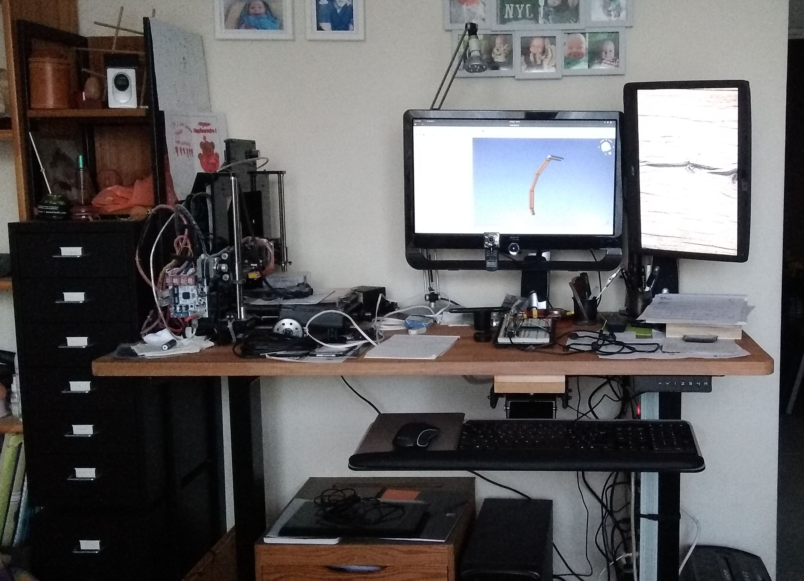

# mydesk
This repository contains all the documents I used to design my own Stand Up Adjustable Desk.  
With a one year lock down and/or teleworking this kind of equipment is no longer a luxury but a necessity.  

This desk uses of the shelf items:
- the desk frame comes from Aliexpress
- the desk top from Castorama (a DIY store)
- drawers from IKEA

  
